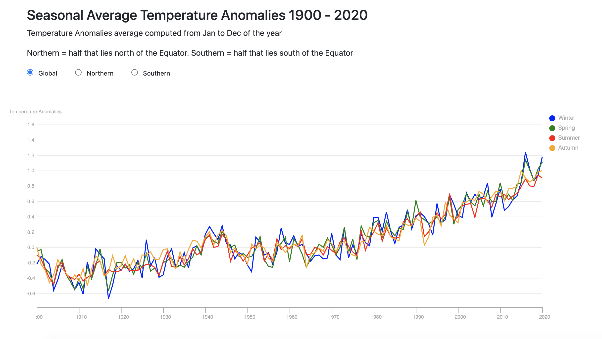
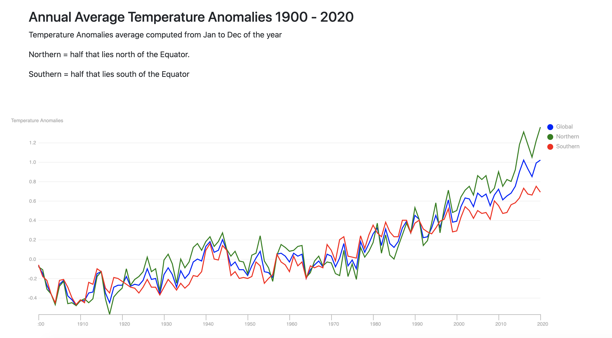

Simply clicks the links for full visualizations of all 4 graphs.

To run on local, setup http-server with npm, or SimpleHttpServer with python.

[Visualization 1: Click to view full visualization](https://huangxuankun.github.io/D3-Global-Temperature-Trend-Visualization/DataViz_1/Part1/)

[Visualization 2: Click to view full visualization](https://huangxuankun.github.io/D3-Global-Temperature-Trend-Visualization/DataViz_1/Part2/)

[Visualization 3: Click to view full visualization](https://huangxuankun.github.io/D3-Global-Temperature-Trend-Visualization/DataViz_1/Part3/)

[Visualization 4: Click to view full visualization](https://huangxuankun.github.io/D3-Global-Temperature-Trend-Visualization/DataViz_1/Part4/)

